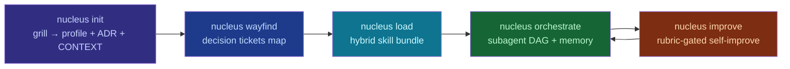

<p align="center">
  
</p>

# nucleus

**A kickoff-to-orchestration utility for AI coding agents: from "I want an app" to a working subagent orchestration.**

`nucleus` grills the user (mattpocock/grilling method), charts a wayfinder map of
decision tickets, loads skills from 7 open ecosystems via a hybrid loader, spins
up a subagent orchestration, and runs artifacts through a GAN-style
self-improvement loop (auto-improve). Core: Node.js + TypeScript; improvement
bridge: Python.

[](package.json)
[](tsconfig.json)
[](pyproject.toml)
[](LICENSE)
[](CONTRIBUTING.md)

**[Русская версия](README.ru.md) · README (EN)**

## Integrated ecosystems

| Ecosystem | ⭐ |
|-----------|----|
| [mattpocock/skills](https://github.com/mattpocock/skills) — grilling, wayfinder, TDD | 203k |
| [affaan-m/ECC](https://github.com/affaan-m/ECC) — 281 skills / 67 agents | 238k |
| [f/prompts.chat](https://github.com/f/prompts.chat) — prompt library | 167k |
| [google-labs-code/stitch-skills](https://github.com/google-labs-code/stitch-skills) — design generation | 7.9k |
| [emilkowalski/skills](https://github.com/emilkowalski/skills) — UI taste & polish | 25k |
| [keepsimple.io/uxcore](https://keepsimple.io/ru/uxcore) — cognitive biases, nudges | datasource |
| [crimeacs/auto-improve](https://github.com/crimeacs/auto-improve) — GAN improvement | 107 |

Deep dive: [`catalog/index.md`](catalog/index.md) and [`docs/ANALYSIS.md`](docs/ANALYSIS.md).

## How it works

```
┌──────────┐   ┌───────────┐   ┌──────────┐   ┌───────────────┐   ┌────────────┐
│  init     │──▶│ wayfind   │──▶│ load     │──▶│  orchestrate  │──▶│  improve   │
│  grill    │   │ tickets   │   │ skills   │   │  subagent DAG │   │  GAN loop  │
└──────────┘   └───────────┘   └──────────┘   └───────────────┘   └────────────┘
```



## One-command install

Requires Node.js ≥ 18.17 and (for `improve`) Python 3.8+.

**Windows (PowerShell):**

```powershell
irm https://raw.githubusercontent.com/CaptchaQ/nucleus/main/scripts/install.ps1 | iex
```

**macOS / Linux / Git Bash:**

```bash
bash <(curl -fsSL https://raw.githubusercontent.com/CaptchaQ/nucleus/main/scripts/install.sh)
```

The installer clones the repo to `~/.nucleus`, builds the core, puts `nucleus`
on PATH, and **registers the `nucleus-agent` skill into agent harnesses**
(`~/.agents/skills`, `~/.config/opencode/skills`, `~/.claude/skills`,
`~/.codex/skills`). After
restarting the agent session, just tell it:

> "create a project through nucleus"

The agent runs the interview itself, assembles the skills, and builds the
orchestration.

### Manual install

```bash
git clone https://github.com/CaptchaQ/nucleus.git && cd nucleus
npm install
npm run build            # → dist/cli/index.js
npm link                 # → global `nucleus` command

nucleus install          # register the skill into harnesses (or `--harness opencode`)
```

## Usage

```bash
nucleus init             # grill the user → .agent-forge/profile.json + ADR + CONTEXT.md
nucleus bootstrap        # one command: profile → map → skills → orchestration → AGENTS.md
nucleus wayfind          # build/resolve decision-ticket map
nucleus load [--install] # assemble the skill bundle (opt. install externals via npx skills)
nucleus orchestrate      # build the subagent DAG from the loaded bundle
nucleus improve <file>   # GAN improvement loop (Python bridge)
nucleus skill add <name> # scaffold a custom skill in .agent-forge/skills/<name>/
nucleus install          # register the agent skill into harnesses (claude-code/opencode/codex)
nucleus catalog          # catalog of skills across all 7 sources
nucleus doctor           # check environment and artifacts
```

### Full pipeline

```bash
nucleus init
nucleus wayfind
nucleus load
nucleus orchestrate
nucleus improve README.md --tag v1 --goal "hero that makes a dev try the CLI"
```

## One-command project workspace

Create a folder for the new project, open PowerShell in it, and run:

```powershell
nucleus bootstrap
```

`bootstrap` sets up the agent workspace non-interactively:

1. **Profile** — from `answers.json` if it sits next to it (`--answers <file>`),
   or from sensible defaults (name = folder name, domain `fullstack`,
   harness `opencode`); an existing `.agent-forge/profile.json` is **not
   overwritten** (refine it with `nucleus init --answers`).
2. **Decision map** — `.agent-forge/wayfinder.json`.
3. **Skill bundle** — `.agent-forge/bundle.json` (`--install` also pulls the
   external repos via `npx skills add`).
4. **Orchestration** — subagent DAG in `.agent-forge/orchestration.json`.
5. **`AGENTS.md`** — the project's "system prompt": omp / opencode /
   claude-code / codex read it at session start and immediately know the
   mission, domain, stack, roles, shared language and out-of-scope.

Then start your agent **in the same folder** (`opencode`, `omp`,
`claude-code`…) — startup instructions are already picked up from `AGENTS.md`.

Options: `--domain web|ui|backend|fullstack|data|ml|cli|mobile|infra|content`
(default `fullstack`), `--install` (fetch external skills), `--answers <file>`.

## Phases

1. **`init` — grill.** The communication gap between a client and an agent is
   the **#1 failure of AI development**. One question at a time, recommended
   answers offered; look up facts, ask only decisions. Output: `ProjectProfile`
   → `docs/adr/0001-destination.md` + `CONTEXT.md`.

2. **`wayfind` — decision tickets.** A task too big for one session becomes a
   **map of decision tickets** (research / prototype / grilling / task) resolved
   one at a time toward the destination. Work beyond the destination is **out of
   scope**, never resolved on route. Methods: cross-reference by name, claim
   before working, one HITL ticket per session.

3. **`load` — hybrid skill loader.** Three delivery channels at once:
   **external** via `npx skills add <repo>`, **overlay** in
   `.agent-forge/skills/<name>/SKILL.md`, **builtin** in `skills/`. The catalog
   (`nucleus catalog`) merges all.

4. **`orchestrate` — subagent DAG.** Roles (planner, researcher, implementer,
   reviewer, tester, designer, security, docs, improver) consult skills from the
   catalog via `ROLE_BY_SKILL`, run on a DAG (downstream = peer work), shared
   memory = file-backed store.

5. **`improve` — GAN self-improvement.** Port of `crimeacs/auto-improve`:
   mutate → score (SEPARATE model) → pairwise 2-order judge → commit to git.
   Two anti-slop rules: judge separate from mutator, and pairwise comparison in
   **both orderings** to cancel position bias.

## Driving it from an agent CLI (opencode / omp / claude-code / codex)

Nucleus is designed so that **the agent runs the pipeline, not the human**.
You tell the agent *"create a notes app through nucleus"* — and the agent:

1. Pulls the question bank: `nucleus init --questions` (JSON).
2. Runs the interview itself, in your chat — one question at a time, with
   recommended answers.
3. Writes answers to a file and runs `nucleus init --answers answers.json`
   (no interaction).
4. Charts the decision map: `nucleus wayfind --json`.
5. Assembles the skill bundle: `nucleus load`.
6. Builds the subagent DAG: `nucleus orchestrate`.
7. Builds the project from the artifacts: `profile.json` (stack, glossary,
   out-of-scope), `wayfinder.json` (tickets), `orchestration.json`
   (roles + skills + downstream edges).

The agent just loads the meta-skill
[`skills/nucleus-agent/SKILL.md`](skills/nucleus-agent/SKILL.md) — it carries
the whole protocol: when to trigger, how to run the interview, how to consume
the artifacts.

```bash
nucleus init --questions   # question bank for the agent-driven interview
nucleus init --answers a.json   # profile from answers (non-interactive)
nucleus wayfind --json     # decision map as JSON, no dialog
```

## Extensibility: "study and add a skill"

```bash
nucleus skill add my-skill   # scaffold .agent-forge/skills/my-skill/SKILL.md
npm run reindex              # sync the catalog and README table
nucleus catalog              # confirm visibility
```

The skill lands on the right subagent automatically via `ROLE_BY_SKILL`. More in
[`skills/nucleus-skill-add/SKILL.md`](skills/nucleus-skill-add/SKILL.md).

## Builtin skills

<!-- NUCLEUS:SKILLS:START -->
| Skill | Description |
|-------|-------------|
| nucleus-agent | How a coding agent (opencode, omp, claude-code, codex, cursor) bootstraps a new project through the nucleus pipeline. Use when the user says "создай проект через nucleus" / "create a project with nucleus" / "use nucleus" — the agent runs the interview itself, feeds answers to nucleus, and consumes profile/wayfinder/bundle/orchestration artifacts to build the project. |
| nucleus-improve | GAN-style self-improvement loop for any text artifact in the repo — READMEs, prompts, copy, contracts, rubric-gated. Mutates, grades with a SEPARATE model, keeps only pairwise-judged wins, commits the rest. The git history is the improvement log. Use when the user wants something measurably better, not just rewritten. |
| nucleus-init | Kick start a project by grilling the user into a sharp ProjectProfile, ADR, and CONTEXT glossary before any code is written. Use when the user is starting a new project, says they "want to build something", or wants to bootstrap a plan. |
| nucleus-orchestrate | Spin up a subagent DAG from the loaded skill bundle — planner, researcher, implementer, reviewer, tester, designer, security, docs, improver — each consulting its relevant skills, with shared memory and explicit downstream edges. Use after a skill bundle is loaded. |
| nucleus-skill-add | Study and add a new skill (from an external repo, a directory, or from scratch) into the project's .agent-forge/skills/<name>/ space, scaffold it, reindex the catalog, and update the documentation. Use when the user says "изучи и добавь скилл" / "study and add this skill". |
| nucleus-wayfind | Chart a big effort as a shared map of decision tickets on the issue tracker, and resolve them one at a time until the way to the destination is clear. Use when a project is too big to hold in one session, or decisions are still foggy after grilling. |
<!-- NUCLEUS:SKILLS:END -->

## Development

```bash
npm run build      # tsc
npm test           # node --test (TS strip-types)
npm run reindex    # sync skill names in README
```

See [`CONTRIBUTING.md`](CONTRIBUTING.md) and [`docs/PLAN.md`](docs/PLAN.md).

## License

[MIT](LICENSE). Skills pulled from the integrated ecosystems stay under their
own licenses and their own repos/spaces.