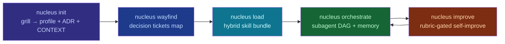

<p align="center">
  
</p>

# nucleus

**Утилита демарша для ИИ-агентов: от «хочу приложение» до работающего оркестра субагентов.**

`nucleus` допрашивает пользователя (по методике mattpocock/grilling), строит карту
decision tickets (wayfinder), подгружает скилы из 7 открытых экосистем гибридным
лоадером, собирает оркестр субагентов и прогоняет артефакты через GAN-цикл
самоулучшения (auto-improve). Ядро — Node.js + TypeScript, bridge самоулучшения —
Python.

[](package.json)
[](tsconfig.json)
[](pyproject.toml)
[](LICENSE)
[](CONTRIBUTING.md)

## Интегрированные экосистемы

| Экосистема | ⭐ |
|-----------|----|
| [mattpocock/skills](https://github.com/mattpocock/skills) — grilling, wayfinder, TDD | 203k |
| [affaan-m/ECC](https://github.com/affaan-m/ECC) — 281 skill / 67 agents | 238k |
| [f/prompts.chat](https://github.com/f/prompts.chat) — библиотека промптов | 167k |
| [google-labs-code/stitch-skills](https://github.com/google-labs-code/stitch-skills) — дизайн-генерация | 7.9k |
| [emilkowalski/skills](https://github.com/emilkowalski/skills) — вкус и полировка UI | 25k |
| [keepsimple.io/uxcore](https://keepsimple.io/ru/uxcore) — когнитивные искажения, nudge | datasource |
| [crimeacs/auto-improve](https://github.com/crimeacs/auto-improve) — GAN-цикл улучшения | 107 |

Подробный разбор — в [`catalog/index.md`](catalog/index.md) и [`docs/ANALYSIS.md`](docs/ANALYSIS.md).

## Как это работает

```
┌──────────┐   ┌───────────┐   ┌──────────┐   ┌───────────────┐   ┌────────────┐
│  init     │──▶│ wayfind   │──▶│ load     │──▶│  orchestrate  │──▶│  improve   │
│  grill    │   │ tickets   │   │ skills   │   │  subagent DAG │   │  GAN loop  │
└──────────┘   └───────────┘   └──────────┘   └───────────────┘   └────────────┘
```



## Установка одной командой

Требуется Node.js ≥ 18.17 и (для `improve`) Python 3.8+.

**Windows (PowerShell):**

```powershell
irm https://raw.githubusercontent.com/CaptchaQ/nucleus/main/scripts/install.ps1 | iex
```

**macOS / Linux / Git Bash:**

```bash
bash <(curl -fsSL https://raw.githubusercontent.com/CaptchaQ/nucleus/main/scripts/install.sh)
```

Установщик: клонирует репозиторий в `~/.nucleus`, собирает ядро, кладёт
команду `nucleus` на PATH и **регистрирует скилл `nucleus-agent` в агентские
харнессы** (`~/.agents/skills`, `~/.config/opencode/skills`, `~/.claude/skills`,
`~/.codex/skills`).
После перезапуска сессии агента достаточно сказать ему:

> «создай проект через nucleus»

Агент сам проведёт допрос, соберёт скилы и построит оркестрацию.

### Ручная установка

```bash
git clone https://github.com/CaptchaQ/nucleus.git && cd nucleus
npm install
npm run build            # → dist/cli/index.js
npm link                 # → команда `nucleus` глобально

nucleus install          # зарегистрировать скилл в харнессы (или `--harness opencode`)
```

## Использование

```bash
nucleus init             # допрос пользователя → .agent-forge/profile.json + ADR + CONTEXT.md
nucleus bootstrap        # одна команда: профиль → карта → скилы → оркестрация → AGENTS.md
nucleus wayfind          # построить/решить карту decision tickets
nucleus load [--install] # собрать бандл скилов (опц. установка внешних через npx skills)
nucleus orchestrate      # построить DAG субагентов из загруженного бандла
nucleus improve <file>   # GAN-цикл улучшения файла (Python bridge)
nucleus skill add <name> # скаффолд кастомного скила в .agent-forge/skills/<name>/
nucleus install          # зарегистрировать скилл агента в харнессы (claude-code/opencode/codex)
nucleus catalog          # каталог скилов по всем 7 источникам
nucleus doctor           # проверить окружение и артефакты
```

### Полный конвейер

```bash
nucleus init
nucleus wayfind
nucleus load
nucleus orchestrate
nucleus improve README.md --tag v1 --goal "hero that makes a dev try the CLI"
```

## Пространство проекта одной командой

Заведите папку под новый проект, откройте в ней PowerShell и выполните:

```powershell
nucleus bootstrap
```

`bootstrap` неинтерактивно настраивает рабочее пространство для агентов:

1. **Профиль** — из `answers.json`, если он лежит рядом (`--answers <file>`),
   или из разумных дефолтов (имя = имя папки, домен `fullstack`,
   харнесс `opencode`); существующий `.agent-forge/profile.json` **не
   перезаписывается** (можно уточнить через `nucleus init --answers`).
2. **Карта решений** — `.agent-forge/wayfinder.json`.
3. **Бандл скилов** — `.agent-forge/bundle.json` (флаг `--install` добавит
   внешние репозитории через `npx skills add`).
4. **Оркестрация** — DAG субагентов в `.agent-forge/orchestration.json`.
5. **`AGENTS.md`** — «системный промпт» проекта: omp / opencode / claude-code /
   codex читают его при старте сессии и сразу знают миссию, домен, стек, роли,
   общий язык и вне-скоуп.

После этого запустите агента **в этой же папке** (`opencode`, `omp`,
`claude-code`…) и работайте — стартовые инструкции уже подхвачены из
`AGENTS.md`.

Опции: `--domain web|ui|backend|fullstack|data|ml|cli|mobile|infra|content`
(дефолт `fullstack`), `--install` (качать внешние скилы), `--answers <file>`.

## Фазы

### 1. `nucleus init` — допрос (grill)

Коммуникационный разрыв между заказчиком и агентом — **#1 провал ИИ-разработки**.
`init` ведёт по одному вопросу за раз, предлагая рекомендуемые ответы, и
записывает решения, а не ищет факты. Правило: *факты — ищи сам, решения —
спрашивай*. Результат: `ProjectProfile` → `docs/adr/0001-destination.md` +
`CONTEXT.md` (общий язык).

### 2. `nucleus wayfind` — decision tickets

Слишком большая для одной сессии задача становится **картой тикетов-решений**
(research / prototype / grilling / task), решаемых по одному к цели. Work за
границей цели классифицируется *вне рамок*. Методы: поимённые ссылки, claim до
работы, одна HITL-тикета за сессию.

### 3. `nucleus load` — гибридный лоадер скилов

Три способа доставки сразу:

- **внешние** — `npx skills add <repo>` (mattpocock, ECC, stitch, emilkowalski, auto-improve);
- **overlay** — кастомные в `.agent-forge/skills/<name>/SKILL.md`;
- **builtin** — встроенные в `skills/`.

Каталог (`nucleus catalog`) объединяет всё.

### 4. `nucleus orchestrate` — оркестр субагентов

Роли (planner, researcher, implementer, reviewer, tester, designer, security,
docs, improver) берут скилы из каталога через таблицу `ROLE_BY_SKILL`, работают
по DAG (downstream — работа «пиров»), общая память — файловый store.

### 5. `nucleus improve` — GAN-цикл самоулучшения

Порт `crimeacs/auto-improve`:

```
for each iteration:
  MUTATE → N кандидатов   SCORE → рубрика (ОТДЕЛЬНАЯ модель)
  DECIDE → pairwise 2-порядковый judge   COMMIT → git-история
```

Два анти-слоп-правила: судья отделён от мутатора (против «переписывания
вкусом»), и pairwise-сравнение в **двух порядках** против позиционного сдвига.

## Использование из агентского CLI (opencode / omp / claude-code / codex)

Nucleus спроектирован так, чтобы **агент гонял конвейер, а не человек**.
Вы говорите агенту: *«создай проект для заметок через nucleus»* — и агент:

1. Получает банк вопросов: `nucleus init --questions` (JSON).
2. Сам проводит интервью у вас в чате — по одному вопросу, с рекомендациями.
3. Пишет ответы в файл и прогоняет `nucleus init --answers answers.json` (без интерактива).
4. Строит карту решений: `nucleus wayfind --json`.
5. Собирает бандл скилов: `nucleus load`.
6. Строит DAG субагентов: `nucleus orchestrate`.
7. Строит проект по артефактам: `profile.json` (стек, глоссарий, out-of-scope),
   `wayfinder.json` (тикеты), `orchestration.json` (роли + скилы + downstream).

Агенту достаточно загрузить мета-скилл [`skills/nucleus-agent/SKILL.md`](skills/nucleus-agent/SKILL.md) —
он описывает весь протокол: когда использовать, как проводить интервью, как
потреблять артефакты.

```bash
# всё, что видит человек:
nucleus init --questions   # банк вопросов для агентского интервью
nucleus init --answers a.json   # профиль из готовых ответов (неинтерактивно)
nucleus wayfind --json  # карта решений JSON-ом, без диалога
```

## Расширяемость: «изучи и добавь скилл»

```bash
nucleus skill add my-skill   # скаффолд .agent-forge/skills/my-skill/SKILL.md
npm run reindex              # синхронизировать каталог и README-таблицу
nucleus catalog              # подтвердить видимость
```

Скил ложится на нужный субагент автоматически через `ROLE_BY_SKILL`. Подробнее —
в [`skills/nucleus-skill-add/SKILL.md`](skills/nucleus-skill-add/SKILL.md).

## Встроенные скилы

<!-- NUCLEUS:SKILLS:START -->
| Skill | Description |
|-------|-------------|
| nucleus-agent | How a coding agent (opencode, omp, claude-code, codex, cursor) bootstraps a new project through the nucleus pipeline. Use when the user says "создай проект через nucleus" / "create a project with nucleus" / "use nucleus" — the agent runs the interview itself, feeds answers to nucleus, and consumes profile/wayfinder/bundle/orchestration artifacts to build the project. |
| nucleus-improve | GAN-style self-improvement loop for any text artifact in the repo — READMEs, prompts, copy, contracts, rubric-gated. Mutates, grades with a SEPARATE model, keeps only pairwise-judged wins, commits the rest. The git history is the improvement log. Use when the user wants something measurably better, not just rewritten. |
| nucleus-init | Kick start a project by grilling the user into a sharp ProjectProfile, ADR, and CONTEXT glossary before any code is written. Use when the user is starting a new project, says they "want to build something", or wants to bootstrap a plan. |
| nucleus-orchestrate | Spin up a subagent DAG from the loaded skill bundle — planner, researcher, implementer, reviewer, tester, designer, security, docs, improver — each consulting its relevant skills, with shared memory and explicit downstream edges. Use after a skill bundle is loaded. |
| nucleus-skill-add | Study and add a new skill (from an external repo, a directory, or from scratch) into the project's .agent-forge/skills/<name>/ space, scaffold it, reindex the catalog, and update the documentation. Use when the user says "изучи и добавь скилл" / "study and add this skill". |
| nucleus-wayfind | Chart a big effort as a shared map of decision tickets on the issue tracker, and resolve them one at a time until the way to the destination is clear. Use when a project is too big to hold in one session, or decisions are still foggy after grilling. |
<!-- NUCLEUS:SKILLS:END -->

## Разработка

```bash
npm run build      # tsc
npm test           # node --test (TS strip-types)
npm run reindex    # синхронизация имён скилов в README
```

См. [`CONTRIBUTING.md`](CONTRIBUTING.md) и [`docs/PLAN.md`](docs/PLAN.md).

## Лицензия

[MIT](LICENSE). Соберите скилы из интегрированных экосистем согласно их
лицензиям — каждая остаётся в своём репо/пространстве.